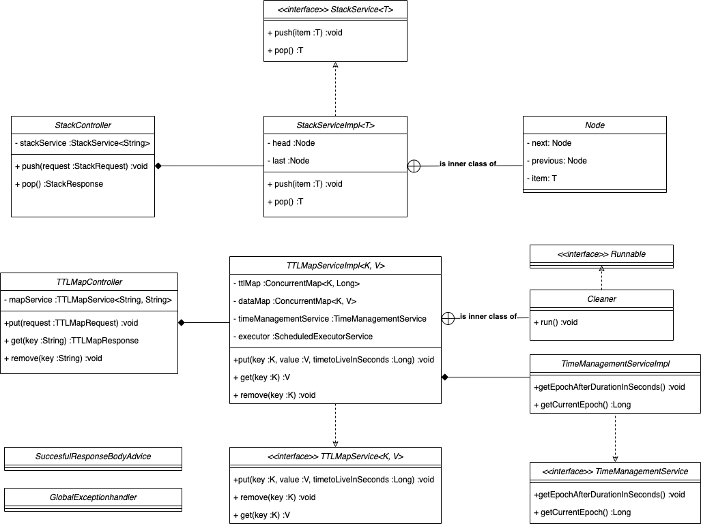

# TMG Java Test

This is a Spring-Boot application created by Caio Riva as an assigment for TMG.

## Requirements
This project was created using [JDK 17](https://openjdk.org/projects/jdk/17/) (the latest LTS release) and 
[Maven 3.8.1](https://maven.apache.org/docs/3.8.1/release-notes.html), so make sure to use them as well when running 
the application.

## Design Choices
The following class diagram describes the main classes that compose the application:



* The class [JDKCollectionStackService](src/main/java/com/example/tmgjavatest/service/JDKCollectionStackService.java) 
 is not included in the diagram because it is not integral part of the application and was just created to demonstrate
 how a stack service would work using a [ConcurrentLinkedDeque](https://docs.oracle.com/javase/7/docs/api/java/util/concurrent/ConcurrentLinkedDeque.html).
* The class [TTLMapConfiguration](src/main/java/com/example/tmgjavatest/configuration/TTLMapConfiguration.java) is not
included in the diagram but it's used to externalize configuration for the [TTLMapServiceImpl](src/main/java/com/example/tmgjavatest/service/TTLMapServiceImpl.java) 
class in the [application.properties](src/main/resources/application.properties) file.

### Data Structure Services
Both services that store the in memory data are [Spring Beans](https://docs.spring.io/spring-framework/docs/current/reference/html/core.html#beans-definition).
They are both `Service` beans and by default `Spring IoC Container` manages all beans as Singleton instances unless a
different prototype is specified. This guarantees that all threads (e.g. when different requests happen at the same time)
access the same in memory data structure.

#### The StackService
For the sake of actually implementing the LIFO logic, the class [StackServiceImpl](src/main/java/com/example/tmgjavatest/service/TimeManagementServiceImpl.java)
was created, and it contains an implementation of a doubly linked list with synchronized methods for the `push` and `pop` operations.
`synchronized` keyword guarantees thread-safety by mutual exclusion: only one thread can execute a block of code (critical area)
at the same time and subsequent threads executing the same block are guarantee to see the modifications previously done.

Executing a synchronized block involves acquiring and releasing a lock (pessimistic approach). This process makes threads
read data from the main java program memory to their own thread memory when acquiring the lock and flush the main program
memory with the updated thread memory when releasing the lock. Eliminating memory inconsistencies.

That said, this process is costly performance wise. It works based on a pessimistic locking algorithm, as threads need
to wait until they can perform the guarded operation.

In a real case scenario it would be more advantageous to use a [ConcurrentLinkedDeque](https://docs.oracle.com/javase/7/docs/api/java/util/concurrent/ConcurrentLinkedDeque.html)
from JDK Collections API. This collection uses compare-and-swap (CAS) operations (low level atomic operations to compare 
and modify the content of a memory location) to achieve thread-safety. Those operations that are significantly less 
expensive than synchronization and the JDK collection does this by leveraging native, JVM internal CAS operations that are 
not typically available to developers (check sun.misc.Unsafe).

For the sake of demonstration, a new class called [JDKCollectionStackService](src/main/java/com/example/tmgjavatest/service/JDKCollectionStackService.java)
was created to show how [ConcurrentLinkedDeque](https://docs.oracle.com/javase/7/docs/api/java/util/concurrent/ConcurrentLinkedDeque.html)
could be used in this scenario.

#### The TTLMapService
The implementation chosen uses [ConcurrentHashMap](https://docs.oracle.com/javase/8/docs/api/java/util/concurrent/ConcurrentHashMap.html)
to store the data and to provide thread-safety (it uses a segmented lock mechanism which allows multiple threads to 
lock multiple segments at the same time). This is more efficient than synchronizing an entire [HashMap](https://docs.oracle.com/javase/8/docs/api/java/util/HashMap.html).

For time-to-live management, two methods to evict expired entries were used: actively 
removing expired entries whenever the `get` operation is called and running a background job in a separate thread to
evict expired entries. The first method guarantees that a expired entry will never be returned to the client, whereas
the second method ensures expired data are not kept in memory indefinitely if the get operation is not called.

The logic for evicting expired entries in the background job has linear complexity (O(n)) as it requires iterating over 
a list. Having the list ordered would increase the efficiency in the  background job but would result in increasing
the complexity for the `put` operation (not recommended because it should have constant complexity (O(1)).

## Installing Dependencies
Because this is a Java application that uses maven as the build and dependency management tool, to install the projects
dependencies, execute the following commend on the [root directory](.):
```
mvn install
```
You can also run the following command on the [root directory](.) if you want to remove obsolete compiled classes
(e.g. renamed classes that are no longer the same in `target/classes`) before installing the dependencies:
```
mvn clean install
```

## Tests
The project supports two different types of tests: unit and integration tests. The project uses
[maven-surefire-plugin](https://maven.apache.org/surefire/maven-surefire-plugin/),
[maven-failsafe-plugin](https://maven.apache.org/surefire/maven-failsafe-plugin/) and
[JUnit 5](https://junit.org/junit5/) tag annotations to run certain test suites for different maven lifecycle phases.

### Unit Tests
To run all unit tests, execute the following commend on the [root directory](.):
```
mvn test
```

### Integration Tests
To run all integration tests (including unit tests), execute the following commend on the [root directory](.):
```
mvn integration-test
```

To only run the integration tests, execute the following commend on the [root directory](.):
```
mvn failsafe:integration-test
```

### API Contract
There are 5 endpoints in total (inside the controller package): 
* GET endpoints return 200 and produce serialized JSON objects based on 
[StandardResponse](src/main/java/com/example/tmgjavatest/model/dto/response/StandardResponse.java) class;
* POST, PUT and DELETE endpoints return 204 with no response body;
* When request validation errors happen, the endpoints return 400 and produce a serialized JSON based 
on `ErrorResponse`record inside [GlobalExceptionHandler](src/main/java/com/example/tmgjavatest/exception/handling/GlobalExceptionHandler.java)
* Retrieving data from an empty stack or accessing a nonexistent key in the map returns 404 and produces a 
serialized JSON based on `ErrorResponse` record inside [GlobalExceptionHandler](src/main/java/com/example/tmgjavatest/exception/handling/GlobalExceptionHandler.java).

#### Successful Request and Response Examples
##### POST /stack/push
###### Request Body
```json
{
    "item": "{item_value}"
}
```
###### Response - Status: 204 No Content
```json
```
##### GET /stack/pop
###### Request Body
```json
```
###### Response - Status: 200 Ok
```json
{
    "status": "OK",
    "timestamp": "{UTC_timestamp_ISO_format}",
    "data": {
        "item": "{item}"
    }
}
```
##### PUT /map/put
###### Request Body
```json
{
  "key": "{key}",
  "value": "{value}",
  "timeToLiveInSeconds": 1
}
```
* `timeToLiveInSeconds` is not required.  
###### Response - Status: 204 No Content
```json
```
##### GET /map/get?key={key}
###### Request Body
```json
```
###### Response - Status: 200 Ok
```json
{
    "status": "OK",
    "timestamp": "{UTC_timestamp_ISO_format}",
    "data": {
        "key": "{key}",
        "value": "{value}"
    }
}
```
##### DELETE /map/remove?key={key}
###### Request Body
```json
```
###### Response - Status: 204 No Content
```json
```

## Suggestions
### Using Postman
If you want to test the application using [Postman](https://www.postman.com/downloads/), a [Postman collection](tmg-java-test.postman_collection.json)
file is included in this project.
